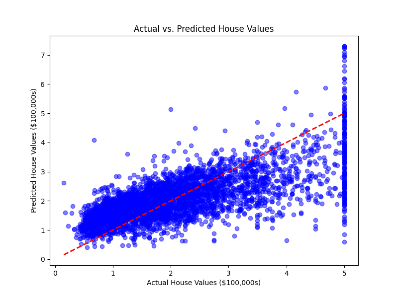

# House Price Prediction



A beginner-friendly ML project to predict house prices using Linear Regression, with a Flask web app for online predictions.

## Description
This project uses the California Housing dataset to train a Linear Regression model, predicting house values based on features like median income and house age. It includes a web interface (Flask) for users to input values and get predictions. The code is modular, with separate files for data loading, model training, visualization, and prediction.

## Requirements
- Python 3.8+
- Install dependencies: `uv pip install -r requirements.txt`

## Setup
1. Clone the repository: `git clone <your-repo-url>`
2. Create a virtual environment: `uv venv`
3. Activate: `source .venv/bin/activate` (Mac/Linux) or `.venv\Scripts\activate` (Windows)
4. Install dependencies: `uv pip install -r requirements.txt`
5. Train the model: `python main.py` (generates `house_price_model.pkl`)

## Usage
### Local Web App
1. Run the Flask app: `python app.py`
2. Open a browser and go to `http://127.0.0.1:5000`
3. Enter `Median Income` (in $10,000s) and `House Age` (years) to get a predicted price.

## Outputs
- `house_price_model.pkl`: Trained model.
- `price_prediction.png`: Plot of actual vs. predicted house values.

## Dataset
California Housing dataset (built into scikit-learn).

## Example Prediction
```python
from predict.predict import predict_new_house
price = predict_new_house(med_inc=8.0, house_age=20.0)
print(f'Predicted price: ${price*100000:.2f}')
```